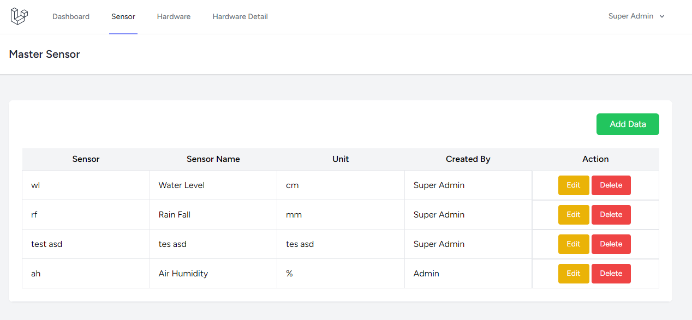
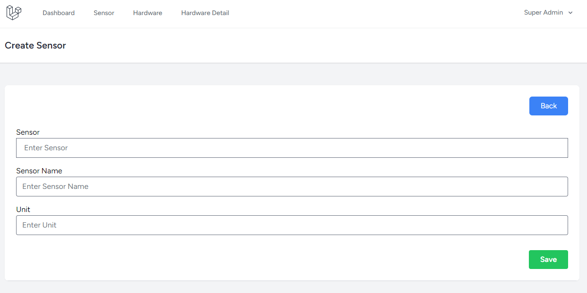
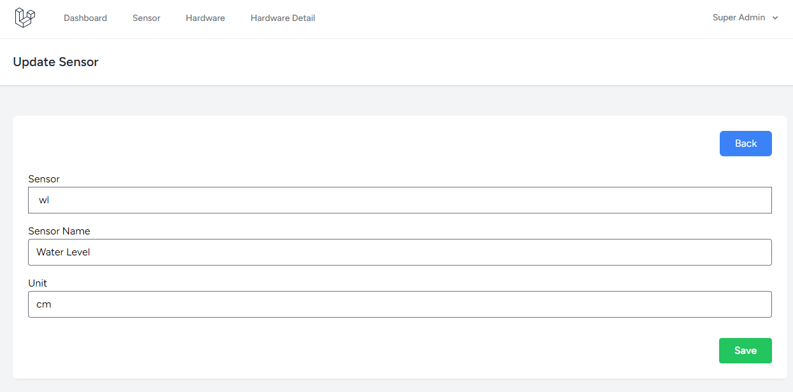
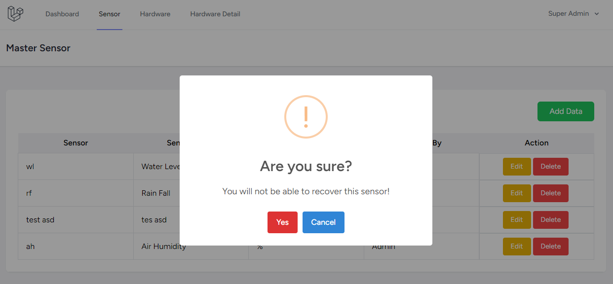

# Laravel-CRUD-React-ForTest

This project was made for a company hiring process.

## How To Start

Please follow the instruction below:

- Clone the repository with **git clone**
- Copy **.env.example** file to **.env** and edit database credentials there
- Run **composer install**
- Run **php artisan migrate**
- Run **php artisan db:seed --class=UserSeeder**
- Run **php artisan serve**
- Run **yarn install**
- Run **yarn dev**

## Screenshot

